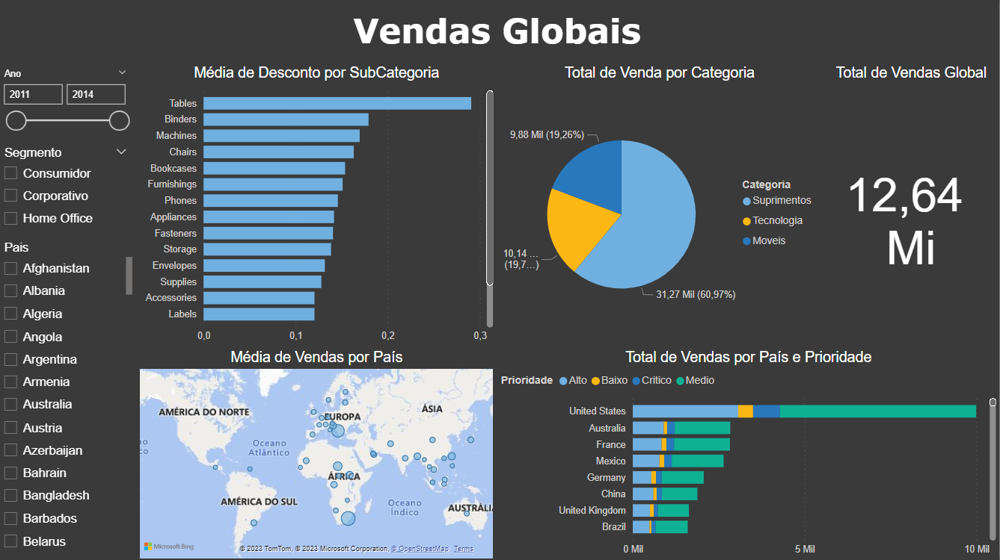

# Dashboard de Vendas Globais
 

  

 

## Sobre o projeto
O dashboard de Vendas Globais foi feito com base em dados de vendas de uma empresa multinacional fictícia, com o objetivo de responder as seguintes questões:

* Qual o valor total vendido?
* Quantas vendas foram realizadas por categoria de produto?
* Quantas vendas foram realizadas por país considerando a prioridade de entrega?
* Qual foi a média de desconto nas vendas por subcategoria de produto?
* Quais países tiveram maior média de valor de venda? (utilizar mapa)

Além disso, foi solicitado que o dashboard tivesse a funcionalidade de filtro: por ano, por segmento e por país.
 
 

* **[Projeto na íntegra (disponível para download)](https://github.com/raffaloffredo/dashboard_vendas_globais/blob/main/Dashboard_Vendas_Globais.pbix)**
 

## Material Extra
Os dados utilizados nesse projeto também estão disponíveis para download.

* **[Dataset de Vendas Globais](https://github.com/raffaloffredo/dashboard_vendas_globais/blob/main/dataset_vendas_globais.csv)**
 

## Outros projetos

* **[Airbnb New York](https://github.com/raffaloffredo/airbnb_new_york_portuguese)**
* **[Estudo atualizado sobre COVID-19 no Brasil e no mundo](https://github.com/raffaloffredo/covid_2023_portuguese)**
* **[Detecção de fraude em cartão de crédito](https://github.com/raffaloffredo/fraud_detection_portuguese)**
 

 ## Contatos

  
  
  
  
  

